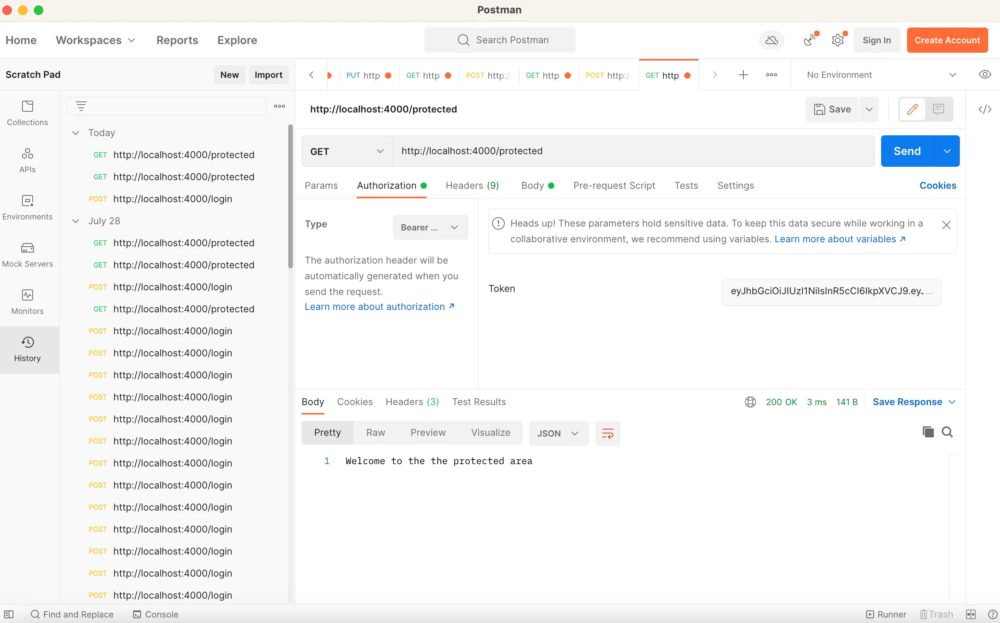

curl  -s  -X POST -H "Content-Type: application/json"  -d '{"username":"user1", "password":"password1"}'  http://localhost:8000/login   -v

# REF
https://www.sohamkamani.com/golang/jwt-authentication/

